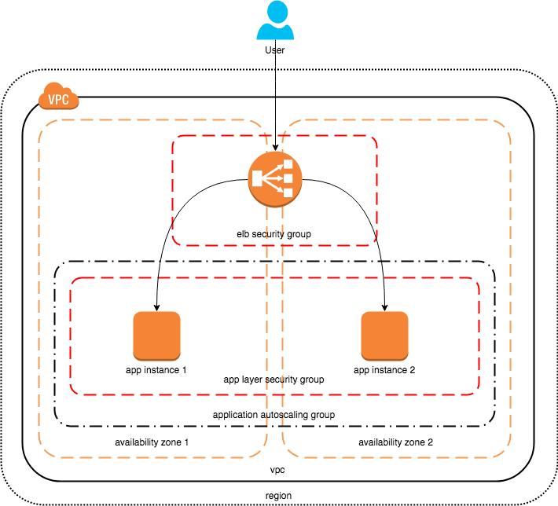

# Simple Application Stack

## Architecture

A simple application is deployed across multiple EC2 instances across multiple availability zones for high availability. User traffic is distributed across multiple application servers using an elastic load balancer.

### Architecture Diagram



### Security

To secure the application, the following measures have been taken.

1.	RHEL 7 Application servers have been hardened to be [CIS compliant](https://www.cisecurity.org/cis-benchmarks/) using Ansible Playbooks provided by [Mind Point Group](https://github.com/MindPointGroup/RHEL7-CIS).
2.	AWS security group has been assigned to application servers that only allows access on port 9292 (Sinatra app port) from ELB. No other access is allowed.
3.	AWS security group has been assigned to the ELB that only allows access from port 80.

## Building a Stack

### Prerequisites

* AWS accout with a VPC already setup
* Please ensure you have installed the latest version of Ansible on the machine where you’ll be building the stack from.
* IMPORTANT! Please note that only RHEL/CentOS 7 images are currently supported.

### Commands to Run

Run the following commands to build a stack.

```bash
git clone https://github.com/achinthagunasekara/simple_application_stack.git
cd ansible
ansible-playbook -vvv plays/create_cloud_formation_stack.yml --extra-vars '{"profile": "archie-sandpit", "stack_name": "archie-simpe-application-stack-1", "template": "/Git_Workspace/simple_application_stack/cf_templates/simple_application_stack.yml", "template_parameters": {"VpcId": "vpc-123456", "Subnets": "subnet-123456", "InstanceType": "t2.micro", "ImageId": "ami-67589505", "KeyName": "archie-sandpit", "ProvisioningRepo": "https://github.com/achinthagunasekara/simple_application_stack.git"}}'
```

Please ensure to provide valid inputs to following parameters from your AWS account.

| Config Item | Description |
|--------------|-------------|
| Profile | AWS credentials profile to use |
| stack_name | Name of the stack |
| template | Full path the template file located under cf_templates |
| VpcId | VPC to build the application stack in |
| Subnets | Subnets to spread application server instances accross |
| InstanceType | Type of EC2 instance to use |
| ImageId | AMI to be used as the base image (RHEL/CentOS 7 AMI ID) |
| KeyName | Key pair to be used for instances |
| ProvisioningRepo | Git repo to pull provisioning code from |

### Accessing the Application

Look for the ELB address in the `output` section of the above command's output.

For Example,

```
"output": "Stack CREATE complete",
    "stack_outputs": {
        "URL": "simple-app-AppElb-1L05K6OD80EQN-861279548.ap-southeast-2.elb.amazonaws.com"
    }
```

### Application Version

The application is directly downloaded from the GitHub via a cloning operation.

A branch or a new repository can be configured by changing the following file.

```
ansible/roles/app_server/defaults/main.yml
```

## Further Improvements

* A jumpbox can be created that can only be accessed from certin IPs. The jumpbox can then be granted SSH access to the application servers for management/debugging purposes.

* To improve application server provisioning time, the operating system security hardening tasks should be run by building an AMI. This AMI can be used to build application servers in the future.

* A Docker image containing the application and its dependencies can be built by following a similar pattern. These images can be pushed to AWS ECR and can be run on AWS ECS. An ELB can then be used to distribute traffic across the containers.

## References 

* MindPointGroup/RHEL7-CIS - https://github.com/MindPointGroup/RHEL7-CIS
* CIS - https://www.cisecurity.org/cis-benchmarks/
